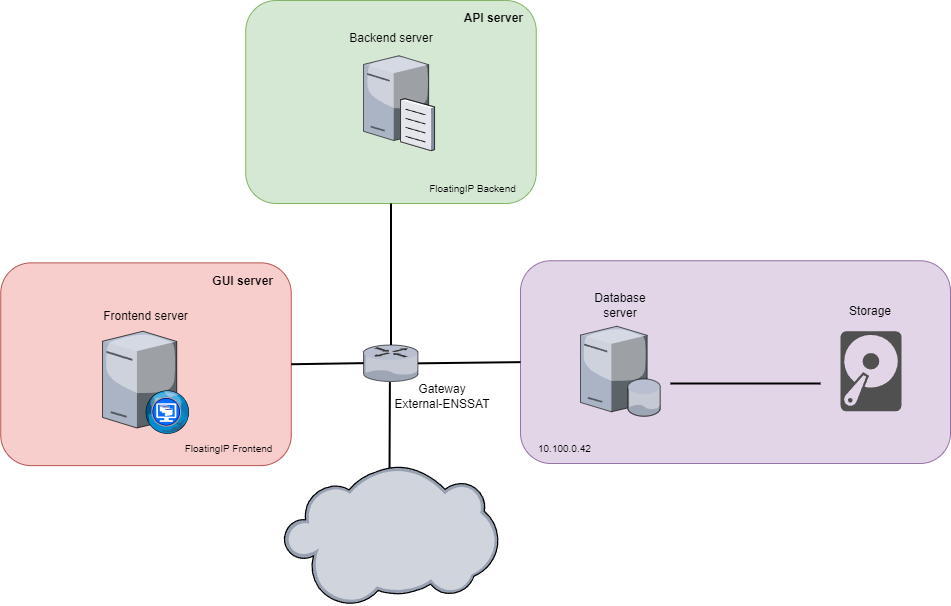

# Projet Cloud

Ce projet vise à déployer automatiquement une application complexe (frontend, backend et storage) séparés dans trois conteneurs Docker sur une infrastructure OpenStack via un modèle Heat.

## Architecture



Notre architecture est composée de 3 serveurs :
- Frontend : la partie client
- Backend : l'API serveur
- Database : la base de données

Le frontend et le backend sont exposés via une IP publique propre à chacun. Tous les serveurs ont des gabarits adaptés à leurs besoins.

## Installation

- Vérifiez que Docker est installé.
- Vérifiez que la CLI OpenStack est installée.
- Téléchargez un fichier RC OpenStack et faites un `source fichier_rc.sh`.
- Exécutez le fichier `deploy.sh`. Celui-ci construira et poussera l'image Docker backend sur le registre et lancera la stack. Après quelques secondes le script vous affichera les IP publiques.

> [!IMPORTANT]  
> Veuillez notez que le déploiement peut durer plusieurs minutes.

Vous pouvez aussi faire cela manuellement :

```bash
# Build and push to registry
docker build -t 148.60.225.81:5000/iai3_10_backend:latest ./app/backend
docker push 148.60.225.81:5000/iai3_10_backend:latest

# Create the stack
openstack stack create --template template.yaml cloud-project

# Update the stack
openstack stack update --template template.yaml cloud-project

# Delete the stack
openstack stack delete cloud-project
```

## Accès en débogage

* `ssh frontend@<frontend_instance_public_IP>` puis saisir le mot de passe `password`.
* `ssh backend@<backend_instance_public_IP>` puis saisir le mot de passe `password`.

Pour accéder au serveur `database` qui ne dispose pas d’adresse publique, on procède par rebond depuis le serveur `backend` :

* `ssh database@<database_instance_private_IP>` puis saisir le mot de passe `password`.

Vous pouvez aussi utiliser les keypairs générées et visibles dans les sorties.
